<a href="https://mino-mateo.github.io">
  <picture>
    <source media="(prefers-color-scheme: dark)" srcset="assets/banner-dark.svg">
    <source media="(prefers-color-scheme: light)" srcset="assets/banner-light.svg">
    
  </picture>
</a>

  <b>Encuentro lo que está expuesto y lo reporto a quien debe corregirlo.</b>
    
  <a href="https://mino-mateo.github.io">Portafolio</a> · <a href="https://www.linkedin.com/in/mateo-miño/">LinkedIn</a> · <a href="https://econdordigital.org">eCondor Digital</a> · <a href="mailto:mateomino08@gmail.com">mateomino08@gmail.com</a>

Soy investigador OSINT y de ciberinteligencia. Mi especialidad es el escaneo de endpoints: con reconocimiento y fuzzing de rutas, parámetros y APIs determino si un sistema público expone datos personales o consultas abiertas. Documento cada hallazgo con trazabilidad y lo reporto a quien corresponde para que se corrija (divulgación responsable).

## Método

<picture>
  <source media="(prefers-color-scheme: dark)" srcset="assets/method-dark.svg">
  <source media="(prefers-color-scheme: light)" srcset="assets/method-light.svg">
  
</picture>

## Resultados

<picture>
  <source media="(prefers-color-scheme: dark)" srcset="assets/impact-dark.svg">
  <source media="(prefers-color-scheme: light)" srcset="assets/impact-light.svg">
  
</picture>

## Proyectos

| Proyecto | Qué hace | Acceso |
|---|---|---|
| **Intellify** | Plataforma de ciberinteligencia: indexación, investigación y fichas OSINT | <kbd>privado</kbd> |
| **Spectra** | Crawler OSINT con mejor interfaz y más información por objetivo | <kbd>privado</kbd> |
| **Sistema GeoQuito** | Visor predial sobre el geoportal público de Quito, más fácil de consultar que el original | <kbd>[demo](https://mino-mateo.github.io/#tools)</kbd> |
| **[Verificador de identificación](https://github.com/Mino-Mateo/Verificador-de-C-dula)** | Validación algorítmica de documentos de Ecuador, Chile, México y Brasil, sin bases externas | <kbd>[demo](https://mino-mateo.github.io/#tools)</kbd> |

Desarrollo a medida con eCondor Digital

 

- **Docentra:** evaluación de docentes, administrativos y directivos (React, Bun, PostgreSQL, .NET).
- **WordyGo:** plataforma multirol de ejercicios de inglés para Salazar Editores (React, Supabase, NestJS).

## Herramientas

<picture>
  <source media="(prefers-color-scheme: dark)" srcset="assets/arsenal-dark.svg">
  <source media="(prefers-color-scheme: light)" srcset="assets/arsenal-light.svg">
  
</picture>

Stack de desarrollo

 

Python · Bash · Linux · TypeScript · JavaScript · React · NestJS · Bun · .NET · Flutter · PostgreSQL · MySQL · MongoDB · Supabase · Leaflet · ArcGIS REST API

---

Tecnólogo Superior en Desarrollo de Software, Escuela Politécnica Nacional (2025) · EPN: Sistemas de Seguridad (2023) · Protección de Datos, DIGIP (2023). Todo el trabajo publicado es autorizado o de divulgación responsable.
